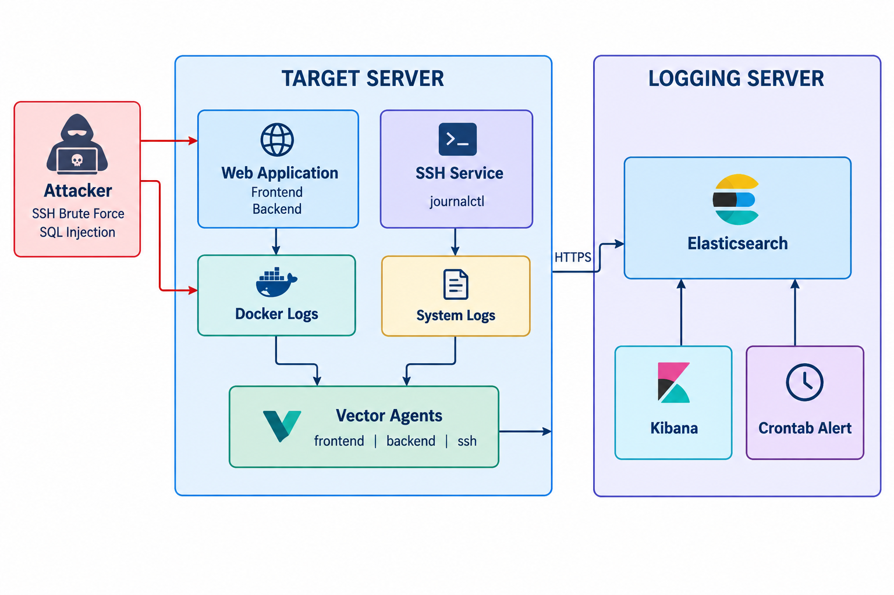

# SIEM with VEK — Attack Simulation & Automated Alerting

## 1. Project Overview

This project implements a **Security Information and Event Management (SIEM)** system based on the **VEK stack — Vector, Elasticsearch, and Kibana**. The system is designed to collect, process, store, visualize, and analyze security-related logs generated by a target server, while also providing automated detection and alerting for simulated cyber attacks.

The lab consists of two servers. The **Target Server** hosts a web application and an SSH service. Vector agents collect logs from multiple sources, including frontend and backend application logs generated by Docker containers, as well as SSH authentication logs from the system journal. The collected logs are parsed, transformed, and forwarded to the **Logging Server**, where Elasticsearch provides centralized log storage and Kibana is used for log analysis and visualization.

To demonstrate the detection capabilities of the SIEM, the project simulates two common attack scenarios: **SSH brute-force attacks** and **SQL injection attacks**. Custom detection rules are implemented using Python scripts that query Elasticsearch and analyze recent events based on predefined thresholds and time windows.

When an attack satisfies a detection rule, the alert engine automatically generates an alert containing relevant information such as the suspected source IP, number of detected events, detection window, and severity. Alerts are delivered through a **Telegram bot**, while Linux `cron` is used to periodically execute the detection scripts.

The overall workflow of the system is:

**Attack Simulation → Target Server → Vector → Elasticsearch → Detection Engine → Telegram Alert**

Through this architecture, the project demonstrates an end-to-end SIEM workflow, from **security event collection and centralized log management to attack detection and automated alerting**.

## 2. Architecture

Architecture: the lab uses 3 servers:

* Target Server: runs web services and Vector agents
* Logging Server: runs Elasticsearch and Kibana
* Attacker: performs simulated attacks against the target (SSH brute force and SQL Injection)



## 3. Target Server

The target for log collection is an Ubuntu server running web services and the SSH systemd service.

### a. Web Service

The repo of the web service is a [web game](https://github.com/QuocGia12/NT208-Project) project with all components running on Docker.
(The web service repo already has the configuration for generating frontend and backend logs.)

Each component generates logs using a different method:

#### Frontend

Generates logs:

* Nginx access log
* Nginx error log
* Next.js log

Method: the Dockerfile uses Nginx to serve the frontend, with the configuration in `nginx.conf` forwarding access and error logs to `/dev/stdout` and `/dev/stderr`.

```conf
# nginx.conf
server {
    listen 80;
    server_name game.com;

    access_log /dev/stdout;
    error_log /dev/stderr;

    location / {
        proxy_pass http://127.0.0.1:3000;

        proxy_http_version 1.1;

        proxy_set_header Host $host;
        proxy_set_header X-Real-IP $remote_addr;
        proxy_set_header X-Forwarded-For $proxy_add_x_forwarded_for;
        proxy_set_header X-Forwarded-Proto $scheme;
    }
}
```

#### Backend

Generates logs:

* App log: HTTP requests and corresponding HTTP response codes, redact sensitive data such as passwords, tokens, cookies, ...
* Prisma log: executed SQL statements, redact parameters
* Node.js log

Method: use `middleware` in the code to generate logs.

### b. SSH Systemd Service

The log source is obtained from `journalctl`, and only logs representing SSH login attempts, both successful and failed, are collected.

## 4. Log Collection & Processing

**Method**: use multiple Vector agents (each agent corresponds to a log source: `web frontend`, `web backend`, `ssh`) to collect and parse logs, then send the logs to the Elasticsearch server.

### a. How to run multiple Vector agents

Create a Vector service template `vector@.service`

```
[Unit]
Description=Vector
Documentation=https://vector.dev
After=network-online.target
Requires=network-online.target

[Service]
User=vector
Group=vector
EnvironmentFile=/etc/vector/.env
ExecStartPre=/usr/bin/vector validate /etc/vector/%i.yaml
ExecStart=/usr/bin/vector --config /etc/vector/%i.yaml
ExecReload=/usr/bin/vector validate --no-environment /etc/vector/%i.yaml
ExecReload=/bin/kill -HUP $MAINPID
Restart=always
AmbientCapabilities=CAP_NET_BIND_SERVICE
EnvironmentFile=-/etc/default/vector
StartLimitInterval=10
StartLimitBurst=5
[Install]
WantedBy=multi-user.target
```

Then, for each `<target>` log source, create a Vector config file `<target>.yaml` in `/etc/vector`. The corresponding Vector agent service for `<target>` is `vector@<target>`.

### b. Configuration of Vector agents

The details of the `.yaml` configuration files for the Vector agents are located in [Config Vector](Config Vector/)

## 5. Detection rules

### a. SSH Login Brute Force

If there are >= 5 failed SSH attempts from the same source IP within the last 5 minutes, flag it.

```
time window = 5 minutes
event.outcome = failure
group by = source.ip
threshold >= 5
```

### b. SQL Injection

If there are >=5 HTTP requests containing SQL injection payloads in the URL path or body from the same source IP within the last 5 minutes, flag it.

```
time window = 5 minutes
event.type = http request
group by = source.ip
threshold >= 5

AND

URL path OR HTTP request body
contains SQL injection patterns
```

## 6. Automated Alerting

**Approach:**

* Write a Python script to query the Elasticsearch server for logs. If the detection rule is satisfied, call the Telegram bot API to send an alert message to the group chat.
* Use a cron job in Linux to automatically run the alert scripts according to a schedule.

The alert scripts are located in [Alert](Alert/)

Configure the cron job as follows:

```
*/5 * * * * cd <alert dir> && python3 alert_sql_injection.py; python3 alert_ssh_login_bruteforce.py
```

## 7. Attack Simulation

### SSH Login Brute Force

Use `Hydra` or use the `ssh_login_brute-force.py` script.

### SQL Injection

Use `sqlmap` or use the `sql_injection.py` script.

## 8. Demo 
### a. SSH Login Brute force 
[Alert SSH login brute force](https://youtu.be/qheDBLS8yiE)
### b. SQL Injection 
[Alert SQL injection](https://youtu.be/fSwzuudoH6E)

